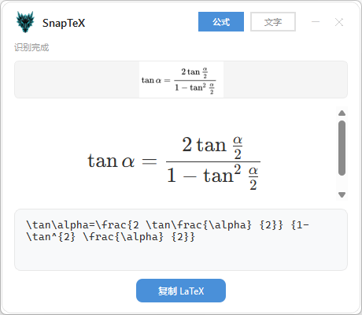
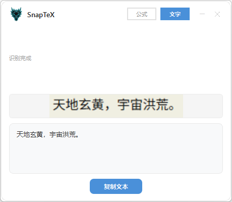

<div align="center">

  <h1>
    <a href="https://github.com/chenyuwang2020/SnapTeX">
      
    </a>
    SnapTeX
  </h1>
  
  <p>
    <strong> 截图识别公式与文字的 Windows 桌面工具 —— 免费、离线、极速🚀</strong>
  </p>

  <p>
    <a href="./LICENSE"></a>
    <a href="https://github.com/chenyuwang2020/SnapTeX"></a>
    <a href="https://github.com/chenyuwang2020/SnapTeX/releases"></a>
  </p>

</div>

## 📖 目录

- [💡 什么是 SnapTeX？](#-什么是-snaptex)
- [🌟 SnapTeX 的特色](#-snaptex-的特色)
- [🎯 核心功能演示](#-核心功能演示)
- [📥 快速开始](#-快速开始) —— *下载与安装指南*
- [❓ 常见问题](#-常见问题) —— *遇到 Bug？看这里！*
- [🛠️ 技术架构](#-技术架构)
- [🔧 开发者指南](#-开发者指南)
- [🙏 致谢](#-致谢)
- [📄 许可证](#-许可证)

---

## 💡 什么是 SnapTeX？

SnapTeX 是一款极其轻量的 Windows 桌面小工具。它可以将屏幕截图中的 **数学公式** 自动转换为 **LaTeX 代码**，同时也支持强大的 **中英文文字识别（OCR）**。

> **✨ 核心体验：只需截个图，完美的 LaTeX 代码就已经在你的剪贴板里了。**

<p align="center">
  <video src="https://github.com/chenyuwang2020/SnapTeX/raw/refs/heads/main/assets/main-ui.mp4" width="80%" autoplay loop muted controls></video>
</p>

---

## 🌟 SnapTeX 的特色？

摒弃了繁琐的配置，SnapTeX 主打纯粹与高效：

- 🔒 **隐私绝对安全**　：所有的识别推理均在**本地电脑**完成。
- ✈️ **断网依然可用**　：模型内置于本地，**无需联网**（首次运行需下载一次模型）。
- ⚡ **毫秒级极速响应**：截图后即刻触发自动识别，结果**几乎“秒出”**。
- 📦 **开箱即用**　　　：无需安装 Python、无需配置环境，**双击即可运行**。

---

## 🎯 核心功能演示

### 📐 LaTeX 公式识别

截取数学公式，自动输出 LaTeX 代码并实时渲染预览。

<p align="center">
  
</p>

### 📝 智能文字识别 (OCR)

截取中英文文字，自动识别并输出纯文本，支持中英混排。

<p align="center">
  
</p>

---

## 📥 快速开始

### 第一步：下载

前往 [Releases](https://github.com/chenyuwang2020/SnapTeX/releases) 页面，下载最新版本的 `SnapTeX-Setup.exe`。

### 第二步：安装

1. 双击 `SnapTeX-Setup.exe`
2. 选择安装路径（可自行调整）
3. 勾选"创建桌面快捷方式"（推荐）
4. 点击"安装"，完成后自动启动

### 第三步：使用

1. **启动**：双击桌面上的 SnapTeX 图标
2. **等待加载**：首次启动会看到进度条（加载公式识别模型，约 1-3 分钟）
3. **截图识别**：
   - 使用你习惯的截图工具（如 `Win+Shift+S`、飞书截图、Snipaste 等）
   - 截取含有公式或文字的区域
   - SnapTeX 自动识别，结果已复制到剪贴板！
4. **粘贴使用**：直接 `Ctrl+V` 粘贴到你的文档、论文、聊天框中

### 模式切换

窗口顶部有两个按钮：

| 模式 | 按钮 | 适用场景 | 输出格式 |
|------|------|---------|---------|
| 公式识别 | `公式` | 截取数学公式 | LaTeX 代码 |
| 文字识别 | `文字` | 截取中英文文字 | 纯文本 |

---

## ❓ 常见问题

### Q: 首次启动很慢？

首次启动需要下载公式识别模型（约 115MB），请确保网络通畅。下载完成后，后续启动约需 6-8 秒加载模型。

### Q: 文字识别模式不需要等待加载？

是的！文字识别使用的 RapidOCR 引擎自带模型，不需要额外下载，启动后立即可用。

### Q: 识别结果不准确？

- **本项目目前没有考虑任何的鲁棒性！请不要做出奇奇怪怪的识别！！🙂‍↔️**
- **公式模式**：适合截取 **单独的公式**，而非整页文档
- **文字模式**：支持中英文混排，截图越清晰效果越好
- 识别结果支持手动编辑，可以在结果框中直接修改

### Q: 如何完全卸载？

两种方式：
1. **控制面板**：设置 → 应用 → SnapTeX → 卸载（会询问是否删除模型数据）
2. **手动删除**：卸载程序后，删除 `%LOCALAPPDATA%\Pix2Text\` 文件夹即可清除所有数据

### Q: 遇到 Bug 怎么办？

1. 右键系统托盘的 SnapTeX 图标
2. 点击"导出日志到桌面"
3. 携带桌面上的 `snaptex.log` 文件，前往 [GitHub Issues](https://github.com/chenyuwang2020/SnapTeX/issues) 提交反馈。

### Q: 数据存储在哪里？

| 内容 | 位置 |
|------|------|
| 配置文件 | `%LOCALAPPDATA%\Pix2Text\config.json` |
| 公式识别模型 | `%LOCALAPPDATA%\Pix2Text\models\` |
| 运行日志 | `%LOCALAPPDATA%\Pix2Text\snaptex.log` |

> 💡 `%LOCALAPPDATA%` 通常是 `C:\Users\你的用户名\AppData\Local`

---

## 🛠️ 技术架构

SnapTeX 基于以下开源项目构建：

| 组件 | 项目 | 用途 |
|------|------|------|
| 公式识别引擎 | [Pix2Text](https://github.com/breezedeus/pix2text) (LatexOCR) | 图片 → LaTeX |
| 文字识别引擎 | [RapidOCR](https://github.com/RapidAI/RapidOCR) (PaddleOCR ONNX) | 图片 → 文本 |
| 公式渲染 | [KaTeX](https://katex.org/) | LaTeX → 可视化预览 |
| GUI 框架 | [PySide6](https://doc.qt.io/qtforpython-6/) (Qt6) | 桌面界面 |
| 打包工具 | [PyInstaller](https://pyinstaller.org/) + [Inno Setup](https://jrsoftware.org/isinfo.php) | 独立 .exe + 安装包 |

---

## 🔧 开发者指南

如果你想从源码运行或参与开发：

### 环境要求

- Windows 10/11 (64-bit)
- Python 3.10
- [uv](https://docs.astral.sh/uv/) 包管理器（推荐）

### 从源码运行

```bash
# 克隆项目
git clone https://github.com/chenyuwang2020/SnapTeX.git
cd SnapTeX

# 创建虚拟环境并安装依赖(uv 是一个极速的 Python 包管理器)
uv venv
uv pip install -e .
uv pip install PySide6 PySide6-WebEngine rapidocr_onnxruntime

# 运行
python -m win_app.main
```

### 构建安装包

```bash
# 仅构建 exe
python win_app/build.py

# 构建 exe + 安装包（需要先安装 Inno Setup）
python win_app/build.py --installer
```

---

## 🙏 致谢

本项目站在巨人的肩膀上：

- **[breezedeus](https://github.com/breezedeus)** 及其 [Pix2Text](https://github.com/breezedeus/pix2text) 项目 —— 提供了强大的公式识别核心能力
- **[RapidAI](https://github.com/RapidAI)** 及其 [RapidOCR](https://github.com/RapidAI/RapidOCR) 项目 —— 提供了高质量的文字识别引擎
- **[KaTeX](https://katex.org/)** —— 提供了优秀的 LaTeX 数学公式渲染
- 所有开源社区的贡献者们

---

## 📄 许可证

本项目基于 MIT 许可证开源，详见 [LICENSE](LICENSE) 文件。

公式识别核心 Pix2Text 采用 MIT 许可证，RapidOCR 采用 Apache 2.0 许可证。
